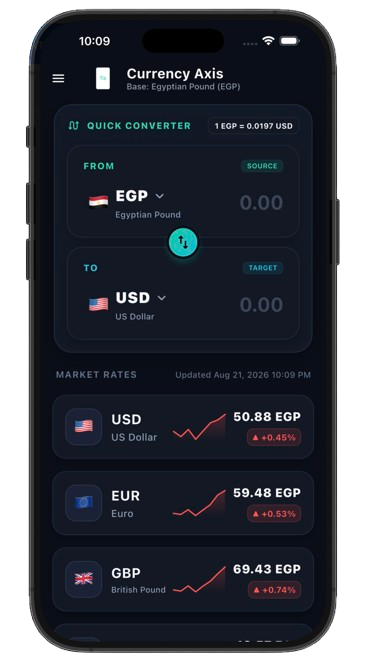
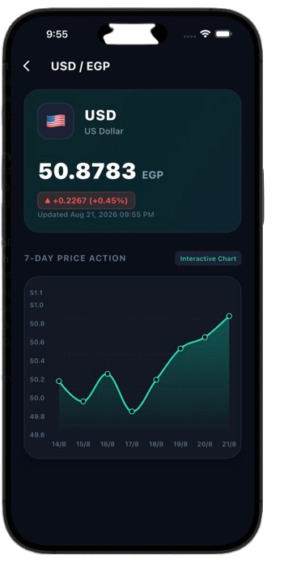

# 💱 Currency Axis (Task Axis)

A modern, high-performance Flutter application for tracking live exchange rates against the **Egyptian Pound (EGP)**, featuring **7-day interactive historical charts**, **offline-first local caching (Hive)**, and built adhering strictly to **Clean Architecture** principles.

---

## 📸 Screenshots & Preview

| Home Screen & Live Rates | 7-Day Price Action Chart | Offline Mode Indicator |
| :---: | :---: | :---: |
|  |  |  |

> **Note:** Replace the image paths in `docs/screenshots/` with your actual app screenshots or GIFs.

---

## ✨ Features

- 🚀 **Real-Time Exchange Rates**: Live exchange rates against EGP for major world currencies (USD, EUR, GBP, SAR, JPY).
- 📈 **7-Day Price Action Chart**: Interactive line chart (`fl_chart`) displaying 7-day rate trends for each currency.
- 📦 **Offline-First Caching (Hive)**: Persists fetched rates locally so the app works seamlessly without an internet connection, displaying an offline banner with the exact last update timestamp.
- 🔄 **Auto-Sync on Reconnect**: Automatically refreshes data when internet connectivity is restored.
- 🎨 **Modern Dark UI**: Glassmorphic dark theme, custom sparklines, responsive layouts (`flutter_screenutil`), and smooth `Hero` animations.

---

## 🏗️ Architecture

The project follows **Clean Architecture** guidelines, separated into 3 distinct layers:

```text
lib/
├── core/
│   ├── di/               # GetIt dependency injection setup
│   ├── error/            # Failures & Exception classes
│   ├── network/          # NetworkInfo & DioFactory
│   ├── networking/       # Retrofit ApiService & ApiErrorModel
│   ├── theme/            # AppColors, AppTextStyles & AppTheme
│   └── utils/            # CurrencyFormatter & helpers
│
└── features/
    └── exchange_rates/
        ├── data/         # Models (Hive & API), DataSources, RepositoryImpl
        ├── domain/       # Entities, Repository Interfaces, UseCases
        └── presentation/ # BLoCs, Screens & Custom Widgets
```

### Layer Breakdown:
1. **Domain Layer**: Contains business entities (`ExchangeRate`), repository interfaces (`ExchangeRepository`), and use cases (`GetLatestRates`, `GetHistoricalRates`). Independent of external frameworks.
2. **Data Layer**: Manages remote data fetching (`Dio` / `Retrofit`) and local persistent caching (`Hive`). Implements repository interfaces.
3. **Presentation Layer**: Handles UI rendering and state management using `BLoC` (`RatesListBloc`, `CurrencyDetailBloc`).

---

## 🛠️ Tech Stack & Dependencies

- **Framework**: [Flutter](https://flutter.dev) (Dart SDK)
- **State Management**: [`flutter_bloc`](https://pub.dev/packages/flutter_bloc)
- **Dependency Injection**: [`get_it`](https://pub.dev/packages/get_it)
- **Local Storage**: [`hive`](https://pub.dev/packages/hive) & [`hive_flutter`](https://pub.dev/packages/hive_flutter)
- **Networking**: [`dio`](https://pub.dev/packages/dio) & [`retrofit`](https://pub.dev/packages/retrofit)
- **Charts & Visualization**: [`fl_chart`](https://pub.dev/packages/fl_chart) & Custom Sparklines
- **Responsive Layout**: [`flutter_screenutil`](https://pub.dev/packages/flutter_screenutil)
- **Functional Programming**: [`dartz`](https://pub.dev/packages/dartz) (Either & Failures)

---

## 🚀 Getting Started

### Prerequisites
- Flutter SDK (`^3.9.0` or higher)
- Android Studio / VS Code

### Installation

1. **Clone the repository:**
   ```bash
   git clone https://github.com/AhmedBahgat010/axis-currency-rates.git
   cd axis-currency-rates
   ```

2. **Install dependencies:**
   ```bash
   flutter pub get
   ```

3. **Generate code (Hive Adapters & Retrofit):**
   ```bash
   dart run build_runner build --delete-conflicting-outputs
   ```

4. **Run the app:**
   ```bash
   flutter run
   ```

---

## 📄 License

This project is open source and available under the [MIT License](LICENSE).
