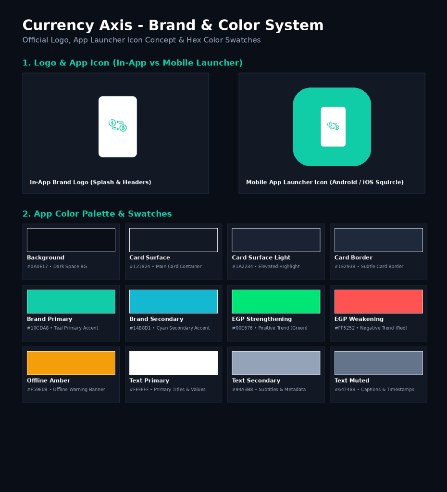
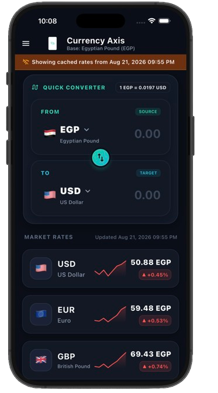
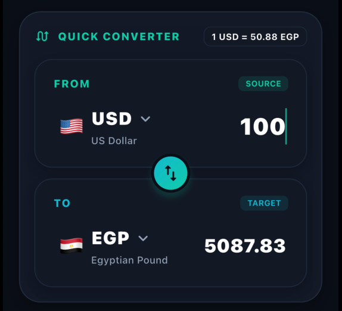
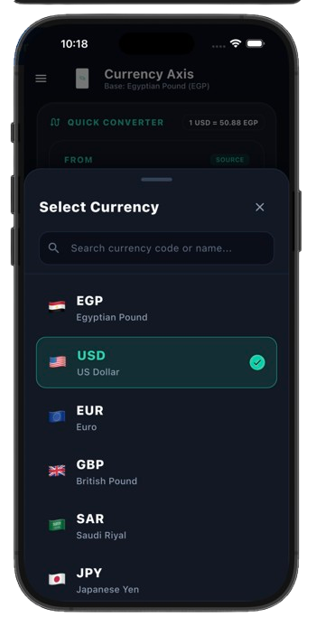

# 💱 Currency Axis (Task Axis)

A modern, high-performance Flutter application for tracking live exchange rates against the **Egyptian Pound (EGP)**, featuring **7-day interactive historical charts**, **offline-first local caching (Hive)**, **multi-language support (Arabic & English)**, and built adhering strictly to **Clean Architecture** principles.

---

## 🎨 Brand & Color System

<p align="center">
  
</p>

---

## 📸 App Screenshots

| Home Screen & Live Rates | 7-Day Price Action Chart | Offline Mode Caching |
| :---: | :---: | :---: |
|  |  |  |

### 🧮 Interactive Quick Converter & Currency Switcher

| Instant Currency Conversion & Swap | Currency Selection Modal |
| :---: | :---: |
|  |  |

---

## ✨ Features

- 🚀 **Real-Time Exchange Rates**: Live exchange rates against EGP for major world currencies (USD, EUR, GBP, SAR, JPY).
- 🧮 **Interactive Quick Converter**: Real-time currency calculator with one-tap bidirectional swap (`EGP ⇄ USD/EUR/GBP/SAR/JPY`) and search modal.
- 📈 **7-Day Price Action Chart**: Interactive line chart (`fl_chart`) displaying 7-day rate trends for each currency.
- 📦 **Offline-First Caching (Hive)**: Persists fetched rates locally so the app works seamlessly without an internet connection, displaying an offline banner with the exact last update timestamp.
- 🔄 **Auto-Sync on Reconnect**: Automatically refreshes data when internet connectivity is restored.
- 🌐 **Multi-Language & RTL Support**: Seamless switching between **Arabic** and **English** with full RTL layout support.
- 🎨 **Modern Dark UI**: Glassmorphic dark theme, custom sparklines, responsive layouts (`flutter_screenutil`), and smooth animations.

---

## 🏗️ Architecture

The project follows **Clean Architecture** guidelines, separated into modular layers:

```text
lib/
├── core/
│   ├── constants/        # App Constants & Keys
│   ├── di/               # GetIt Dependency Injection setup
│   ├── error/            # Failures & Exception handling
│   ├── helpers/          # General helper functions
│   ├── network/          # NetworkInfo & Connectivity Checker
│   ├── networking/       # Retrofit ApiService, DioFactory & Error Models
│   ├── routing/          # AppRouter & Named Routes
│   ├── theme/            # AppColors, AppTextStyles & Theme Data
│   └── utils/            # CurrencyFormatter & helper methods
│
├── features/
│   ├── exchange_rates/   # Main Feature (Rates & Historical Charts)
│   │   ├── data/         # Models (Hive & API), DataSources, RepositoryImpl
│   │   ├── domain/       # Entities, Repository Interfaces, UseCases
│   │   └── presentation/ # BLoCs/Cubits (RatesList, CurrencyDetail, Converter), Screens & Widgets
│   │
│   └── settings/         # Settings Feature (Theme & Language)
│       └── presentation/ # LocaleCubit, ThemeCubit & Drawer Widget
│
├── l10n/                 # Localization (ARB files for AR/EN)
├── doc_app.dart          # MaterialApp root configuration
└── main.dart             # App entry point & initialization
```

### Layer Breakdown:
1. **Domain Layer**: Contains business entities (`ExchangeRate`), repository interfaces (`ExchangeRepository`), and use cases (`GetLatestRates`, `GetHistoricalRates`). Independent of external frameworks.
2. **Data Layer**: Manages remote data fetching (`Dio` / `Retrofit`) and local persistent caching (`Hive`). Implements repository interfaces.
3. **Presentation Layer**: Handles UI rendering and state management using `BLoC` & `Cubit` (`RatesListBloc`, `CurrencyDetailBloc`, `CurrencyConverterCubit`).

---

## 🛠️ Tech Stack & Dependencies

- **Framework**: [Flutter](https://flutter.dev) (Dart SDK)
- **State Management**: [`flutter_bloc`](https://pub.dev/packages/flutter_bloc)
- **Dependency Injection**: [`get_it`](https://pub.dev/packages/get_it)
- **Local Storage**: [`hive`](https://pub.dev/packages/hive) & [`hive_flutter`](https://pub.dev/packages/hive_flutter)
- **Networking**: [`dio`](https://pub.dev/packages/dio) & [`retrofit`](https://pub.dev/packages/retrofit)
- **Connectivity**: [`connectivity_plus`](https://pub.dev/packages/connectivity_plus)
- **Localization**: [`flutter_localizations`](https://api.flutter.dev/flutter/flutter_localizations/flutter_localizations-library.html) & `intl` (Arabic & English)
- **Charts & Visualization**: [`fl_chart`](https://pub.dev/packages/fl_chart) & Custom Sparklines
- **Responsive Layout**: [`flutter_screenutil`](https://pub.dev/packages/flutter_screenutil)
- **Functional Programming**: [`dartz`](https://pub.dev/packages/dartz) (Either & Failures)

---

## 🚀 Getting Started

### Prerequisites
- Flutter SDK (`^3.9.0` or higher)
- Android Studio / VS Code

### Installation

1. **Clone the repository:**
   ```bash
   git clone https://github.com/AhmedBahgat010/axis-currency-rates.git
   cd axis-currency-rates
   ```

2. **Install dependencies:**
   ```bash
   flutter pub get
   ```

3. **Generate code (Hive Adapters & Retrofit):**
   ```bash
   dart run build_runner build --delete-conflicting-outputs
   ```

4. **Run the app:**
   ```bash
   flutter run
   ```

---

## 📄 License

This project is open source and available under the [MIT License](LICENSE).
